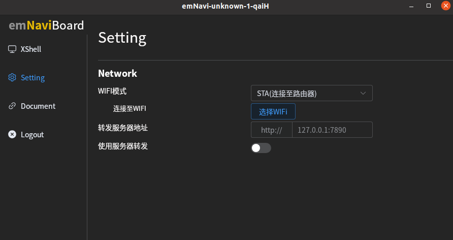

# emNavi Discover
**emNavi Discover** 集成了emnavi设备快速连接、终端运行等常用功能。
## 操作系统支持
- windows
- Ubuntu(>=22.04)
- Docker


## ubuntu 22.04 及以上
发布页面找到[对应安装包(.deb)](https://github.com/emNavi/emnavidiscover/releases)

## 通过docker使用
```bash
# 下载项目
git clone https://github.com/emNavi/emnavidiscover.git

# 构建 Docker 镜像
cd emnavidiscover
sudo docker build -t emnavidiscover-exec:v0.1 .

# 配置桌面可视化
echo "xhost +" >> ~/.bashrc

# 构建 Docker 容器
sudo docker run -it --privileged --env=LOCAL_USER_ID="$(id -u)" -v /tmp/.X11-unix:/tmp/.X11-unix:ro -e DISPLAY=$DISPLAY --network host --cap-add=NET_BROADCAST --rm emnavidiscover-exec:v0.1 bash -c "GDK_DISABLE_SHM=1 emnavidiscover"
```
添加到环境变量 `.bashrc` 中
```bash
echo 'alias emnavidiscover="sudo docker run -it --privileged --env=LOCAL_USER_ID=\"\$(id -u)\" \
    -v /tmp/.X11-unix:/tmp/.X11-unix:ro -e DISPLAY=\$DISPLAY \
    --network host --cap-add=NET_BROADCAST --rm \
    emnavidiscover-exec:v0.1 bash -c \"GDK_DISABLE_SHM=1 emnavidiscover\""' >> ~/.bashrc
```
启动 emNavi Discover
```bash
emnavidiscover
```

## 在 Windows 中使用
Windows下需要配置环境，点击安装 [ WinPcap](https://emnavi-doc-img.oss-cn-beijing.aliyuncs.com/emnavi_video/intro/WinPcap_4_1_3.exe)

<!-- 点击安装 [emnavidiscover](https://emnavi-doc-img.oss-cn-beijing.aliyuncs.com/emnavi_video/intro/Discover_0.1.0_x64-setup.exe) -->

在[此页面下载](https://github.com/emNavi/emnavidiscover/releases)
安装完成后，在桌面上能找到该软件启动
